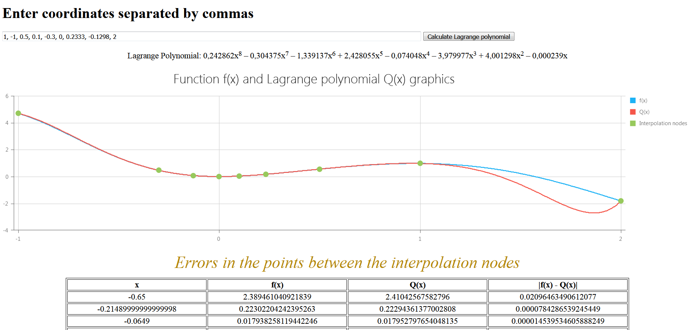

## Interpolation with Lagrange polynomial   

Web-application allows you to interpolate the array of
coordinates (x, y) into continuous function.    

#### How does it work?

Enter the arguments separated by commas, from 4 to 10 pieces.
The function y = f(x) is hardcoded on the server side (you can change it manually). Press the button
and watch the result:

#### How does it run?

* Make sure you have Maven and JDK 8 or more installed.
If you use IDE, just run main function in `LagnangeApplication`

* or use `mvn clean install` and put jar file into 
your servlet container.

* Check `localhost://8080`

#### Technologies used:
* Spring Boot, Thymeleaf
* Lombok
* DevExpress (JavaScript)
* Maven

#### *P.S*.
*This project has been developed as part of the course project
for Samara University in 2020*
